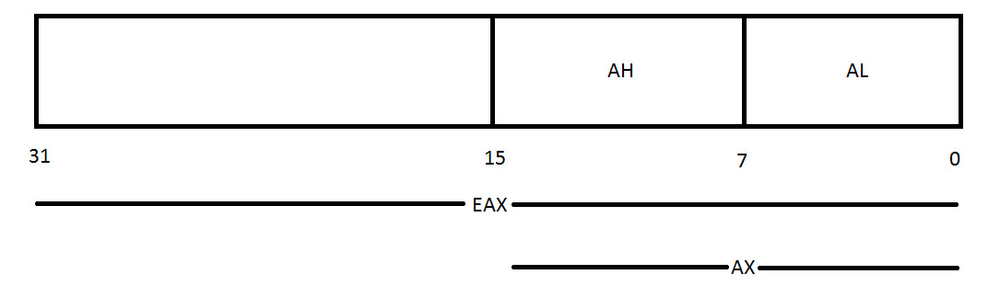
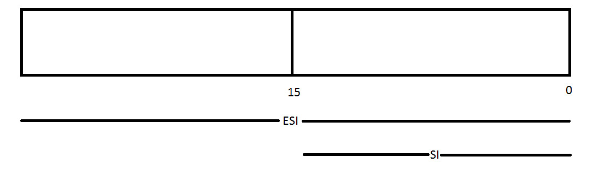

ثبات‌های همه‌منظوره (General-purpose registers) برای ذخیره موقت داده‌ها در هنگام پردازش بر روی پردازنده استفاده می‌شوند. این ثبات‌ها در طول زمان به شدت تکامل یافته‌اند و همچنان در حال بهبود هستند. ما برای اهداف خود روی معماری ۳۲ بیتی x86 تمرکز خواهیم کرد.

هر نسخه جدیدی از ثبات‌های همه‌منظوره برای سازگاری با پردازنده‌های قبلی ایجاد شده است. این بدان معنی است که کدی که از ثبات‌های ۸ بیتی در چیپ‌های 8080 استفاده می‌کند، همچنان بر روی چیپ‌های ۶۴ بیتی امروزی کار می‌کند.

ثبات‌های همه‌منظوره می‌توانند هر نوع داده‌ای را نگه دارند، اما برخی از آن‌ها کاربردهای خاصی پیدا کرده‌اند که در برنامه‌ها استفاده می‌شوند. بیایید به بررسی ۸ ثبات همه‌منظوره در معماری IA-32 بپردازیم.

- **EAX**: ثبات اصلی که در محاسبات حسابی استفاده می‌شود. به عنوان «Accumlator» یا انباره شناخته می‌شود، زیرا نتایج عملیات حسابی و مقادیر بازگشتی از توابع را نگه می‌دارد.
  
- **EBX**: ثبات پایه (Base Register). اشاره‌گر به داده‌ها در بخش DS است. برای ذخیره آدرس پایه برنامه استفاده می‌شود.

- **ECX**: ثبات شمارنده (Counter Register) که معمولاً مقداری را نگه می‌دارد که نشان‌دهنده تعداد تکرار یک فرایند است. در عملیات حلقه و رشته‌ها استفاده می‌شود.

- **EDX**: ثباتی همه‌منظوره. همچنین برای عملیات ورودی/خروجی (I/O) و برای گسترش EAX به ۶۴ بیت استفاده می‌شود.

- **ESI**: ثبات شاخص منبع (Source Index Register). اشاره‌گر به داده‌ها در بخشی که توسط ثبات DS اشاره می‌شود. در عملیات رشته و آرایه به عنوان آدرس افست استفاده می‌شود. آدرس مکانی را نگه می‌دارد که داده‌ها از آن خوانده می‌شود.

- **EDI**: ثبات شاخص مقصد (Destination Index Register). اشاره‌گر به داده‌ها (یا مقصد) در بخشی که توسط ثبات ES اشاره می‌شود. در عملیات رشته و آرایه به عنوان آدرس افست استفاده می‌شود و آدرس نوشتن را نگه می‌دارد.

- **EBP**: ثبات پایه پشته (Base Pointer). اشاره‌گر به داده‌ها در پشته (در بخش SS). به انتهای فریم پشته جاری اشاره می‌کند و برای ارجاع به متغیرهای محلی استفاده می‌شود.

- **ESP**: ثبات اشاره‌گر پشته (Stack Pointer). به ابتدای فریم پشته جاری اشاره می‌کند و برای ارجاع به متغیرهای محلی استفاده می‌شود.

توجه داشته باشید که هر یک از این ثبات‌ها ۳۲ بیتی یا ۴ بایتی هستند. نیمهٔ پایین این ثبات‌ها در EAX، EBX، ECX و EDX می‌توانند با نام AX و سپس به دو بخش AH (برای نیمهٔ بالا) و AL (برای نیمهٔ پایین) به عنوان ۱ بایت تقسیم شوند. همچنین، ثبات‌های ESI، EDI، EBP و ESP با معادل ۱۶ بیتی خود یعنی SI، DI، BP و SP قابل ارجاع هستند.

این موضوع ممکن است برای کسی که در رشتهٔ مهندسی کامپیوتر مطالعه نکرده است کمی گیج‌کننده باشد، اما جدول زیر می‌تواند به درک بهتر کمک کند: 

ثبات (Register) **EAX** دارای یک بخش 16 بیتی به نام **AX** است و این **AX** می‌تواند به دو بخش 8 بیتی تقسیم شود: **AL** برای 8 بیت پایینی و **AH** برای 8 بیت بالایی. همین ساختار برای **EBX**، **ECX** و **EDX** نیز صدق می‌کند. به عنوان مثال:

- **EBX**: بخش 16 بیتی آن **BX** است و **BX** نیز می‌تواند به **BL** برای 8 بیت پایینی و **BH** برای 8 بیت بالایی تقسیم شود.
- **ECX**: بخش 16 بیتی آن **CX** است و **CX** نیز می‌تواند به **CL** برای 8 بیت پایینی و **CH** برای 8 بیت بالایی تقسیم شود.
- **EDX**: بخش 16 بیتی آن **DX** است و **DX** نیز می‌تواند به **DL** برای 8 بیت پایینی و **DH** برای 8 بیت بالایی تقسیم شود.

همچنین ثبات‌های **ESI**، **EDI**، **EBP** و **ESP** می‌توانند به بخش‌های 16 بیتی زیر تقسیم شوند:

ثبات **ESI** دارای بخش 16 بیتی به نام **SI** است.  
ثبات **EDI** دارای بخش 16 بیتی به نام **DI** است.  
ثبات **EBP** دارای بخش 16 بیتی به نام **BP** است.  
ثبات **ESP** نیز دارای بخش 16 بیتی به نام **SP** است.

در آموزش بعدی، بحث خود را درباره معماری **IA-32** ادامه خواهیم داد و به ثبات‌های **Segment Registers** خواهیم پرداخت.