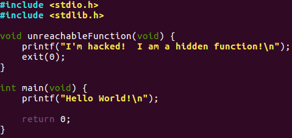
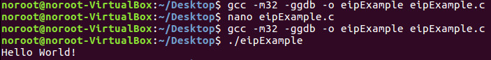
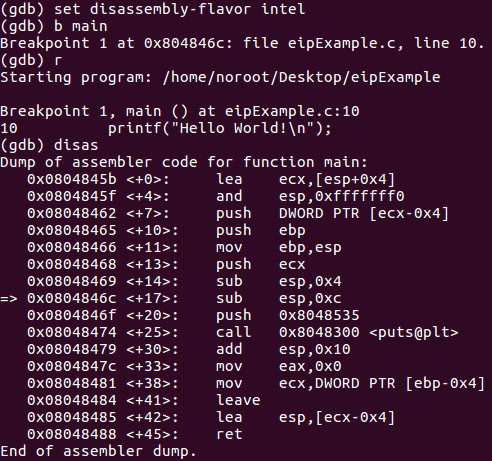
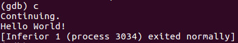
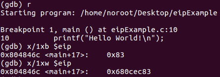
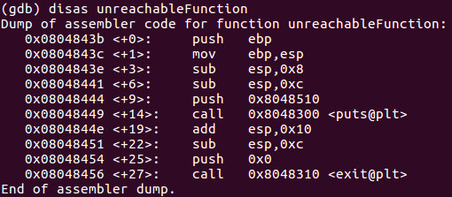
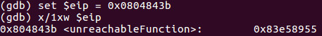
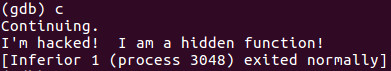

## Part 12: Instruction Pointer Register

رجیستر اشاره‌گر دستور (Instruction Pointer Register) که به آن رجیستر EIP گفته می‌شود، مهم‌ترین رجیستری است که در هر مهندسی معکوس با آن سر و کار خواهید داشت. EIP مسئول پیگیری کد دستور بعدی است که باید اجرا شود. این رجیستر به دستور بعدی اشاره می‌کند که قرار است اجرا شود. اگر شما این اشاره‌گر را تغییر دهید تا به ناحیه دیگری از کد بپرد، به‌طور کامل بر آن برنامه کنترل دارید.

بیایید جلوتر برویم و به برخی کدها نگاهی بیندازیم. در اینجا مثالی از یک برنامه ساده "سلام دنیا" (hello world) در زبان C داریم که در آینده در درس‌های ما به جزئیات بیشتری خواهیم پرداخت. هدف ما امروز این است که قدرت واقعی زبان اسمبلی و به‌خصوص قدرت رجیستر EIP را ببینیم و اینکه چگونه می‌توانیم کنترل برنامه را به‌طور کامل هک کنیم.

نگران نباشید اگر متوجه نشدید که این کد چه کار می‌کند یا عملکرد آن چیست. نکته‌ای که باید به آن توجه کنید این است که ما یک تابع به نام `unreachableFunction` داریم که هرگز توسط تابع اصلی (main) فراخوانی نمی‌شود. همان‌طور که خواهید دید، اگر بتوانیم رجیستر EIP را کنترل کنیم، می‌توانیم این برنامه را هک کنیم تا آن کد را اجرا کند!

ما به سادگی کد را طوری کامپایل کرده‌ایم که با مجموعه دستورات IA32 کار کند و آن را اجرا کرده‌ایم. همان‌طور که مشاهده می‌کنید، هیچ فراخوانی به تابع `unreachableFunction` وجود ندارد و تحت شرایط عادی قابل دسترسی نیست. وقتی این برنامه اجرا می‌شود، پیام «Hello World!» چاپ می‌شود.

ما برنامه را با استفاده از دیباگر GDB دیس‌اسمبل کرده‌ایم. ما یک نقطه توقف روی تابع main قرار داده و برنامه را اجرا کردیم. علامت `=>` نشان می‌دهد که EIP به کجا اشاره می‌کند وقتی که به دستور بعدی می‌رویم. اگر جریان عادی برنامه را دنبال کنیم، پیام «Hello World!» در کنسول چاپ شده و برنامه خاتمه می‌یابد.

اگر برنامه را دوباره اجرا کنیم و بررسی کنیم که EIP به کجا اشاره می‌کند، خواهیم دید:

ما می‌توانیم ببینیم که EIP به آدرس `main+17` یا به آدرس `0x680cec83` اشاره می‌کند.

بیایید تابع **`unreachableFunction`** را بررسی کنیم و ببینیم که در کجا در حافظه شروع می‌شود و آن آدرس را یادداشت کنیم.

مرحله بعدی این است که EIP را به آدرس **`0x0804843b`** تنظیم کنیم تا جریان برنامه را دزدیده و تابع **`unreachableFunction`** را اجرا کنیم.

حالا که کنترل EIP را به دست گرفته‌ایم، بیایید ادامه دهیم و ببینیم چگونه عملیات یک برنامه در حال اجرا را به نفع خود دزدیده‌ایم!

هورا! ما برنامه را هک کردیم!

حالا ممکن است برایتان سوال پیش بیاید که چرا این را به شما نشان دادم در حالی که هیچ ایده‌ای از این قضیه ندارید؟ مهم است که در طول یک آموزش طولانی مانند این، گاهی نگاهی به جلو بیندازیم تا ببینیم چرا باید این همه مرحله را برای یادگیری اصول اولیه طی کنیم قبل از اینکه به جزئیات بپردازیم. با این حال، مهم است که به شما نشان دهم اگر با این آموزش همراه باشید، تلاش شما نتیجه خواهد داد، زیرا یاد خواهیم گرفت که چگونه می‌توانیم هر برنامه‌ای را در حال اجرا هک کنیم تا آن را به هر چیزی که می‌خواهیم وادار کنیم، و همچنین به طور پیشگیرانه یک برنامه مخرب را تحلیل کنیم تا بتوانیم نه تنها آن را غیرفعال کنیم بلکه ردی از آن به منبع احتمالی هک پیدا کنیم.

در آموزش بعدی، ادامه بحث خود درباره معماری IA-32 را با رجیسترهای کنترل دنبال خواهیم کرد.