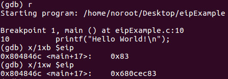
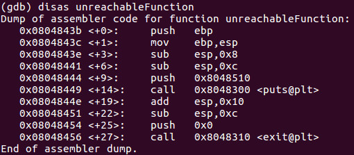

## Part 12: Instruction Pointer Register

رجیستر "اشاره‌گر دستور" (Instruction Pointer Register) یا همون EIP، یکی از مهم‌ترین رجیسترها توی مهندسی معکوسه و خیلی باهاش سروکار داریم. کار EIP اینه که پیگیری کنه دستور بعدی که قراره اجرا بشه چیه. درواقع، این رجیستر همیشه به دستور بعدی اشاره می‌کنه که باید اجرا بشه. حالا اگه شما بتونید این اشاره‌گر رو طوری تغییر بدید که به یه جای دیگه از کد بپره، می‌تونید کلاً برنامه رو دست خودتون بگیرید و کنترلش کنید!

بریم جلوتر و یه سری کد رو با هم ببینیم. اینجا یه مثال ساده از برنامه‌ی "سلام دنیا" (hello world) رو به زبان C داریم که بعداً تو درس‌ها مفصل‌تر بررسیش می‌کنیم. هدفمون امروز اینه که قدرت واقعی زبان اسمبلی و مخصوصاً رجیستر EIP رو نشون بدیم و ببینیم چطوری می‌تونیم کنترل کامل برنامه رو به دست بگیریم و عملاً هکش کنیم!

نگران نباشید اگه دقیقاً متوجه نشدید این کد چیکار می‌کنه یا چجوری کار می‌کنه. چیزی که باید بهش توجه کنید اینه که ما یه تابع داریم به اسم `unreachableFunction` که هیچ‌وقت توسط تابع اصلی (main) صدا زده نمی‌شه. حالا نکته جالب اینجاست: اگه بتونیم رجیستر EIP رو کنترل کنیم، می‌تونیم کاری کنیم که این برنامه به جای مسیر معمولش، اون تابع رو اجرا کنه! یعنی عملاً برنامه رو هک کنیم تا هرچی که می‌خوایم اجرا کنه!

ما به راحتی کد رو طوری کامپایل کردیم که با مجموعه دستورات IA-32 کار کنه و بعد اجراش کردیم. همون‌طور که می‌بینید، هیچ جایی کدی نداریم که تابع `unreachableFunction` رو صدا بزنه، پس تو شرایط عادی اصلاً قابل دسترسی نیست. وقتی این برنامه اجرا می‌شه، پیام «Hello World!» رو چاپ می‌کنه.

ما برنامه رو با دیباگر GDB دیس‌اسمبل کردیم. یه نقطه توقف (Breakpoint) روی تابع main گذاشتیم و برنامه رو اجرا کردیم. علامت `=>` نشون می‌ده که EIP به کجا اشاره می‌کنه وقتی داریم به دستور بعدی می‌ریم. اگه جریان عادی برنامه رو دنبال کنیم، پیام «Hello World!» توی کنسول چاپ می‌شه و برنامه تموم می‌شه.

اگه برنامه رو دوباره اجرا کنیم و چک کنیم که EIP به کجا اشاره می‌کنه، می‌بینیم که:

می‌توانیم ببینیم که EIP به آدرس `main+17` یا به آدرس `0x680cec83` اشاره می‌کند.

حالا بیایید تابع **`unreachableFunction`** رو بررسی کنیم و ببینیم که کجا در حافظه شروع می‌شه و اون آدرس رو یادداشت کنیم.

مرحله بعدی اینه که EIP رو به آدرس **`0x0804843b`** تنظیم کنیم تا جریان برنامه رو دزدیده و تابع **`unreachableFunction`** رو اجرا کنیم.

حالا که کنترل EIP رو به دست آوردیم، بیایید ادامه بدیم و ببینیم چطور می‌تونیم عملیات یک برنامه در حال اجرا رو به نفع خودمون دزدیده باشیم!

هورا! ما برنامه رو هک کردیم!

حالا ممکنه براتون سوال پیش بیاد که چرا اینو بهتون نشون دادم در حالی که هنوز ایده‌ای ازش ندارید؟ مهمه که توی یک آموزش طولانی مثل این، گاهی نگاهی به جلو بندازیم تا بفهمیم چرا باید این همه مرحله رو برای یادگیری اصول اولیه طی کنیم قبل از اینکه به جزئیات بپردازیم. همچنین، می‌خوام به شما نشون بدم که اگه با این آموزش همراه باشید، تلاش‌هاتون نتیجه خواهد داد. چون یاد خواهیم گرفت چطور می‌تونیم هر برنامه‌ای رو در حال اجرا هک کنیم و اون رو به هر چیزی که می‌خواهیم وادار کنیم. همچنین می‌تونیم یک برنامه مخرب رو تحلیل کنیم تا نه تنها بتونیم اون رو غیرفعال کنیم، بلکه ردی ازش به منبع احتمالی هک پیدا کنیم.

در آموزش بعدی، ادامه بحث درباره معماری IA-32 رو با رجیسترهای کنترل دنبال خواهیم کرد.