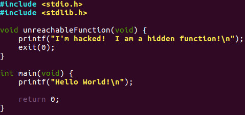

## Part 15: Stack

توابع یکی از مهم‌ترین ویژگی‌ها در توسعه نرم‌افزار هستند. یک تابع به شما اجازه می‌دهد کدها را به شکل منطقی سازمان‌دهی کنید تا وظیفه مشخصی را انجام دهد. در این مرحله، لازم نیست که دقیقاً بفهمید توابع چگونه کار می‌کنند. نکته اصلی این است که وقتی شروع به یادگیری برنامه‌نویسی می‌کنیم، می‌خواهیم با استفاده از توابع از تکرار کد جلوگیری کنیم. این باعث می‌شود که حافظه به‌درستی استفاده شود و کدها چند بار بدون نیاز به نوشتن دوباره، اجرا شوند.

وقتی یک برنامه شروع به اجرا می‌کند، بخشی پیوسته از حافظه برای آن برنامه کنار گذاشته می‌شود که به آن پشته (stack) می‌گویند.

پشته توسط یک رجیستر به نام "اشاره‌گر پشته" یا **stack pointer** کنترل می‌شود. این رجیستر آدرس بالای پشته را در خود نگه می‌دارد. برای مثال، اگر آدرس بالای پشته 0x00001000 باشد، هر آدرسی که از این مقدار کمتر باشد، غیرمعتبر است و هر آدرسی که بیشتر باشد، معتبر به شمار می‌آید.

آدرس بالا به‌طور تصادفی انتخاب شده و مقدار قطعی نیست. در واقع، محل اشاره‌گر پشته در هر برنامه متفاوت است. حالا بیایید به صورت کلی نگاهی به شکل پشته از دیدگاه انتزاعی بیندازیم.

در این توضیحات، چیزی که باید در ذهن خود به وضوح نگه دارید، همان چیزی است که واقعاً در حافظه اتفاق می‌افتد. نمودارهای بعدی خلاف این را نشان خواهند داد. 

در این نمودارها، خواهید دید که پشته به سمت بالا رشد می‌کند، اما در واقعیت، پشته از آدرس‌های بالاتر به سمت آدرس‌های پایین‌تر رشد می‌کند. 

در مثال "addMe" که در ادامه می‌آید، وقتی برنامه به نقطه توقف (breakpoint) در تابع main می‌رسد و اشاره‌گر پشته (ESP) در حافظه بررسی می‌شود، مقدار آن 0xffffd050 است. هنگامی که برنامه تابع addMe را از تابع main فراخوانی می‌کند، مقدار ESP به 0xffffd030 تغییر می‌کند که در حافظه پایین‌تر است. بنابراین، پشته به سمت پایین رشد می‌کند، حتی اگر نمودار نشان دهد که به سمت بالا اشاره می‌کند. کافی است در ذهن داشته باشید که وقتی فلش‌ها به سمت بالا اشاره می‌کنند، در واقع به سمت آدرس‌های پایین‌تر اشاره دارند.

"پایین پشته" بزرگترین آدرس معتبر پشته است و در بخش بزرگتر آدرس‌ها (یا قسمت بالای مدل حافظه) قرار دارد. این ممکن است گیج‌کننده باشد، زیرا پایین پشته در حافظه بالاتر است. پشته در واقع به سمت پایین رشد می‌کند و بسیار مهم است که این نکته را درک کنید.

"محدوده پشته" کوچک‌ترین آدرس معتبر پشته است. اگر اشاره‌گر پشته از این مقدار کوچکتر شود، پشته دچار سرریز (stack overflow) می‌شود، که می‌تواند باعث خرابی برنامه و در نتیجه کنترل سیستم توسط مهاجم شود. بدافزارها اغلب از سرریز پشته سوءاستفاده می‌کنند. در سیستم‌عامل‌های مدرن تدابیری برای جلوگیری از این نوع حملات در نظر گرفته شده است.

دو عملیات اصلی در پشته وجود دارد: **push** (فشردن) و **pop** (برداشتن). با عملیات push، یک یا چند رجیستر با تنظیم اشاره‌گر پشته به مقدار کوچکتر (کاهش دادن آن) به پشته اضافه می‌شوند. این کار معمولاً با کم کردن چهار برابر تعداد رجیسترهایی که باید به پشته اضافه شوند و کپی کردن رجیسترها به پشته انجام می‌شود.

در عملیات pop، داده‌ها از پشته به رجیسترها کپی می‌شوند و سپس اشاره‌گر پشته با اضافه کردن مقداری به آن، به سمت بالا تنظیم می‌شود. این معمولاً با افزودن چهار برابر تعداد رجیسترهایی که باید از پشته برداشته شوند انجام می‌شود.

حالا بیایید نگاهی به نحوه استفاده از پشته برای پیاده‌سازی توابع بیندازیم. برای هر فراخوانی تابع، بخشی از پشته به آن تابع اختصاص داده می‌شود که به آن **قاب پشته** (stack frame) می‌گویند.

در ادامه، برنامه‌ای را که در آموزش ۱۲ ایجاد کرده‌ایم، بررسی خواهیم کرد تا ببینیم تابع main چگونه به نظر می‌رسد.

در اینجا دو تابع داریم. اولین تابع، به نام **unreachableFunction**، تحت شرایط عادی هرگز اجرا نخواهد شد. و تابع دوم، **main** است که همیشه اولین تابعی خواهد بود که روی پشته فراخوانی می‌شود.

وقتی این برنامه اجرا شود، پشته به این شکل خواهد بود:

می‌توانیم قاب پشته برای تابع `int main(void)` را در بالا ببینیم. به این قاب همچنین "رکورد فعال‌سازی" نیز گفته می‌شود. قاب پشته زمانی وجود دارد که یک تابع شروع شده اما هنوز کامل نشده است. به عنوان مثال، در داخل بدنه تابع `int main(void)`، یک فراخوانی به تابع `int addMe(int a, int b)` وجود دارد که دو آرگومان `a` و `b` را می‌پذیرد. باید کد اسمبلی در تابع `int main(void)` وجود داشته باشد تا آرگومان‌های تابع `int addMe(int a, int b)` را به پشته اضافه کند. بیایید مقداری کد را بررسی کنیم.

وقتی این برنامه را کامپایل و اجرا کنیم، مقدار ۵ به این شکل چاپ می‌شود:

به‌سادگی، تابع `int main(void)` ابتدا تابع `int addMe(int a, int b)` را فراخوانی می‌کند و به این شکل در پشته قرار می‌گیرد:

با قرار دادن آرگومان‌ها در پشته، اندازه قاب پشته برای `int main(void)` افزایش یافته است. همچنین فضایی برای مقدار بازگشتی که توسط `int addMe(int a, int b)` محاسبه می‌شود، رزرو کرده‌ایم. وقتی تابع باز می‌گردد، مقدار بازگشتی در `int main(void)` بازیابی می‌شود و اجرای برنامه در `int main(void)` ادامه می‌یابد تا تمام شود.

پس از دریافت دستورات برای `int addMe(int a, int b)`، تابع ممکن است به متغیرهای محلی نیاز داشته باشد، بنابراین تابع باید مقداری فضا در پشته قرار دهد که به این شکل خواهد بود:

تابع `int addMe(int a, int b)` می‌تواند به آرگومان‌های ارسال شده از `int main(void)` دسترسی پیدا کند زیرا کد در `int main(void)` آرگومان‌ها را به شکلی قرار می‌دهد که `int addMe(int a, int b)` انتظار دارد.

FP (اشاره‌گر قاب) به محلی اشاره می‌کند که اشاره‌گر پشته (SP) درست قبل از حرکت به سمت متغیرهای محلی خود `int addMe(int a, int b)` قرار داشته است.

استفاده از اشاره‌گر قاب زمانی ضروری است که یک تابع احتمالاً چندین بار در طول اجرای خود، اشاره‌گر پشته را جابجا کند. ایده این است که اشاره‌گر قاب برای مدت زمان قاب پشته `int addMe(int a, int b)` ثابت بماند. در همین حین، اشاره‌گر پشته می‌تواند مقادیر متفاوتی داشته باشد.

ما می‌توانیم از اشاره‌گر قاب برای محاسبه موقعیت‌های حافظه برای هر دو آرگومان و همچنین متغیرهای محلی استفاده کنیم. از آنجایی که این اشاره‌گر حرکت نمی‌کند، محاسبات برای این موقعیت‌ها باید از اشاره‌گر قاب به صورت یک جابجایی ثابت انجام شود.

زمانی که زمان خروج از `int addMe(int a, int b)` فرا برسد، اشاره‌گر پشته به جایی تنظیم می‌شود که اشاره‌گر قاب قرار دارد و این عمل قاب پشته `int addMe(int a, int b)` را از پشته حذف می‌کند.

به طور خلاصه، پشته یک ناحیه خاص از حافظه است که متغیرهای موقتی ایجاد شده توسط هر تابع از جمله main را ذخیره می‌کند. پشته یک ساختار داده LIFO (آخرین ورودی، اولین خروجی) است که به طور نزدیک توسط CPU مدیریت و بهینه‌سازی می‌شود. هر بار که یک تابع یک متغیر جدید اعلام می‌کند، آن متغیر به پشته اضافه می‌شود. هر بار که یک تابع به پایان می‌رسد، تمام متغیرهایی که توسط آن تابع به پشته اضافه شده‌اند، آزاد یا حذف می‌شوند. زمانی که یک متغیر پشته آزاد می‌شود، آن ناحیه از حافظه برای متغیرهای دیگر در پشته در دسترس قرار می‌گیرد.

مزیت استفاده از پشته برای ذخیره متغیرها این است که مدیریت حافظه به عهده شما نیست. شما نیازی به تخصیص حافظه به‌صورت دستی یا آزاد کردن آن به‌صورت دستی ندارید. CPU حافظه پشته را به‌طور بسیار کارآمد و سریع مدیریت و سازمان‌دهی می‌کند.

مهم است که درک کنید وقتی یک تابع به پایان می‌رسد، تمام متغیرهای آن از پشته حذف می‌شوند و برای همیشه از بین می‌روند. متغیرهای پشته محلی هستند. پشته به‌طور مداوم با افزودن و حذف متغیرهای محلی رشد و کوچک می‌شود.

می‌توانم ببینم که ممکن است کمی گیج شده باشید. به یاد داشته باشید، این مباحث پیچیده هستند و در آموزش‌های آینده ادامه خواهند یافت. ما با موضوعات گیج‌کننده زیادی مانند رجیسترها، حافظه و اکنون پشته سر و کار داریم و این ممکن است زیاد به نظر برسد. اگر سوالی دارید، لطفاً در زیر کامنت بگذارید و من به شما کمک می‌کنم تا این چارچوب را بهتر درک کنید.

در آموزش بعدی، درباره پشته (heap) صحبت خواهیم کرد.