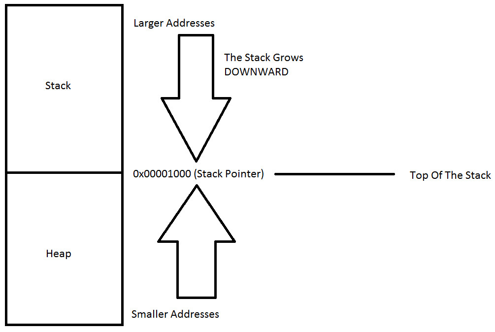

## Part 16: Heap

گام بعدی ما در بخش مهندسی معکوس بدافزار پایه بر روی heap تمرکز دارد. به یاد داشته باشید، stack به سمت پایین رشد می‌کند و heap به سمت بالا. درک این مفهوم بسیار، بسیار مهم است زیرا در آموزش‌های آینده پیش خواهیم رفت.

پشته heap ناحیه‌ای از حافظه کامپیوتر شما است که به‌طور خودکار مدیریت نمی‌شود و به‌طور نزدیکی توسط CPU مدیریت نمی‌شود. این یک ناحیه آزاد از حافظه است و بزرگ‌تر از تخصیص حافظه پشته است.

برای تخصیص حافظه در heap ، باید از توابع داخلی C به نام‌های `malloc()` یا `calloc()` استفاده کنید. پس از تخصیص حافظه در heap ، شما مسئول آزاد کردن آن با استفاده از `free()` هستید تا زمانی که دیگر به آن نیاز ندارید.

اگر این مرحله را انجام ندهید، برنامه شما دچار آنچه به آن نشتی حافظه (memory leak) می‌گویند، خواهد شد. یعنی حافظه در heap هنوز کنار گذاشته شده و برای دیگر فرایندهایی که به آن نیاز دارند در دسترس نخواهد بود.

برخلاف استک، heap محدودیت‌های اندازه بر روی اندازه متغیرها ندارد. تنها چیزی که می‌تواند محدود کننده heap باشد، محدودیت‌های فیزیکی کامپیوتر شما است. حافظه heap کمی کندتر از حافظه استک خوانده و نوشته می‌شود، زیرا برای دسترسی به حافظه در heap باید از اشاره‌گرها استفاده کنید. وقتی که به سری آموزش‌های C ما بپردازیم، این موضوع را نشان خواهیم داد.

برخلاف استک، متغیرهایی که در heap ایجاد می‌شوند، توسط هر تابعی، در هر جایی از برنامه شما قابل دسترسی هستند. متغیرهای heap به‌طور اساسی در دامنه global هستند.

اگر نیاز به تخصیص یک بلوک بزرگ از حافظه برای چیزی مانند یک ساختار (struct) یا یک آرایه بزرگ دارید و باید آن متغیر را برای مدت طولانی‌تری از برنامه حفظ کنید و به‌طور جهانی به آن دسترسی داشته باشید، باید heap را برای این منظور انتخاب کنید. اگر نیاز به متغیرهایی مانند آرایه‌ها و ساختارهایی دارید که می‌توانند به‌طور دینامیک اندازه‌شان تغییر کنند، مانند آرایه‌هایی که می‌توانند به‌دلخواه بزرگ یا کوچک شوند، پس احتمالاً باید آن‌ها را در heap تخصیص دهید و از توابع تخصیص حافظه دینامیک مانند `malloc()`، `calloc()`، `realloc()` و `free()` برای مدیریت دستی آن حافظه استفاده کنید.

گام بعدی این است که به برنامه‌نویسی C در محیط لینوکس بپردازیم، جایی که گام‌به‌گام هر برنامه C را تجزیه‌و‌تحلیل خواهیم کرد، به طوری که در واقع شما هم برنامه‌نویسی C و هم اسمبلی را یاد خواهید گرفت تا بتوانید مهارت‌های خود را در تحلیل بدافزار و مهندسی معکوس پیش ببرید.

منتظر دیدن شما در هفته آینده هستم، زمانی که یک آموزش جامع گام‌به‌گام درباره نحوه نصب لینوکس بر روی کامپیوتر فعلی شما با استفاده از نرم‌افزار رایگان Virtual Box داشته باشیم.