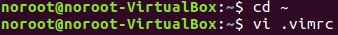
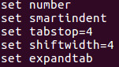
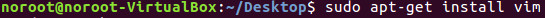

## Part 18 - vim Text Editor

حالا که یک نسخه کارآمد از لینوکس داریم، به یک ویرایشگر متن نیاز داریم که بتوانیم در ترمینال با آن کار کنیم.

برای شروع، ترمینال خود را باز کرده و این دستور را تایپ کنید:

این دستور ویرایشگر متن vi را باز می‌کند. اولین کاری که باید انجام دهید این است که حرف 'i' را تایپ کنید تا ویرایشگر به حالت درج (insert mode) برود و بتوانید شروع به تایپ کنید.

بعد از اینکه تایپتان تمام شد، کلید '__esc__' را فشار دهید و '__:wq__' را تایپ کنید و سپس Enter را بزنید.

تبریک! شما اولین فایل خود را ایجاد کردید! این یک فایل یک‌باره است که باید ایجاد کنیم تا ویرایشگر متن به شکلی که ما می‌خواهیم کار کند.

اولین خط می‌گوید __set number__ که به این معنی است که می‌خواهیم هر فایل شماره خطوط را نشان دهد، زیرا این موضوع برای دیباگ کردن کد ضروری است. دستورات __set smartindent__، __set tabstop__، __set shiftwidth__ و __set expandtab__ قوانینی را برای قالب‌بندی صحیح کد مشخص می‌کنند و ۴ فاصله به ازای هر تب درج می‌شود که به کد کمک می‌کند تا مرتب و خوانا باشد.

چند دستور مهم وجود دارد که باید به آن‌ها توجه کنید. به یاد داشته باشید که برای ورود به حالت فرمان (command mode) به جای حالت درج (insert mode) باید کلید '__esc__' را فشار دهید. در زیر، رایج‌ترین دستورات آورده شده است:

__j__ یا فلش پایین [حرکت به یک خط پایین‌تر]

__k__ یا فلش بالا [حرکت به یک خط بالاتر]

__h__ یا فلش چپ [حرکت به یک کاراکتر چپ‌تر]

__l__ یا فلش راست [حرکت به یک کاراکتر راست‌تر]

__0__ [حرکت به ابتدای خط فعلی]

__$__ [حرکت به انتهای خط فعلی]

__b__ [حرکت به ابتدای کلمه قبلی]

__dd__ [حذف خطی که نشانگر روی آن است]

__D__ [حذف از موقعیت نشانگر تا انتهای خط]

__yy__ [کپی کردن خط فعلی]

__p__ [قرار دادن متن کپی‌شده بعد از نشانگر]

__u__ [برگشت آخرین تغییرات]

__:w__ [ذخیره فایل]

__:wq__ [ذخیره فایل و خروج از ویرایشگر]

__:q!__ [خروج از ویرایشگر بدون ذخیره تغییرات]

شما مرتباً بین حالت فرمان '__esc__' و حالت درج '__i__' جابجا خواهید شد. به یاد داشته باشید که زمانی که می‌خواهید کاراکترها را وارد کنید باید در حالت درج باشید و زمانی که می‌خواهید نشانگر را حرکت دهید، باید در حالت فرمان باشید.

حالا که vi را تنظیم کردیم، بیایید vim را نصب کنیم که برخی قابلیت‌های بهتر دارد. کافی است تایپ کنید:

وقتی که نصب شد، به جای استفاده از vi حالا از vim استفاده خواهیم کرد.

منتظر دیدار شما در هفته آینده هستم، زمانی که در مورد اهمیت یادگیری زبان Assembly صحبت خواهیم کرد.