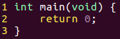
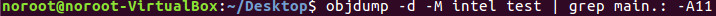
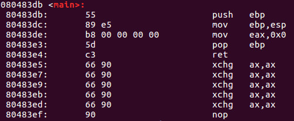

## Part 20 - Instruction Code Handling

یک CPU کدهای دستوری را که در حافظه ذخیره شده‌اند، می‌خواند. هر مجموعه از کدهای دستورالعمل شامل یک یا چند بایت از اطلاعات است که به پردازنده دستور می‌دهد تا یک کار بسیار خاص را انجام دهد. هر بار که یک کد دستورالعمل از حافظه خوانده می‌شود، هر داده‌ای که برای آن دستور لازم باشد نیز در حافظه ذخیره و از آن خوانده می‌شود.

باید توجه داشته باشید که حافظه‌ای که شامل کدهای دستورالعمل است، تفاوتی با بایت‌های داده که توسط CPU استفاده می‌شوند ندارد. اشاره‌گرهای ویژه‌ای وجود دارند که به CPU کمک می‌کنند تا مکان دقیق داده‌ها و کدهای دستورالعمل در حافظه را پیگیری کند.

یک اشاره‌گر داده به CPU کمک می‌کند تا بداند از کجای حافظه بخش داده‌ها شروع می‌شود، که این بخش در استک (stack) قرار دارد. هنگامی که عناصر جدید داده در استک قرار می‌گیرند، اشاره‌گر استک در حافظه به سمت پایین حرکت می‌کند و زمانی که داده از استک خوانده می‌شود، این اشاره‌گر به سمت بالا حرکت می‌کند. اگر این مفهوم را نمی‌فهمید، به قسمت ۱۵ – استک مراجعه کنید.

اشاره‌گر دستورالعمل به CPU کمک می‌کند تا بداند کدام کدهای دستورالعمل قبلاً پردازش شده‌اند و کدام کدها باید بعداً پردازش شوند. اگر این مفهوم را نمی‌فهمید، به قسمت ۱۲ – ثبات اشاره‌گر دستورالعمل مراجعه کنید.

هر کد دستورالعمل باید یک __opcode__ داشته باشد که عملکرد یا وظیفه اصلی را که باید توسط CPU انجام شود تعریف می‌کند. __Opcode__ها بین ۱ تا ۳ بایت طول دارند و به طور منحصر به فرد عملکردی را که باید انجام شود تعریف می‌کنند.

بیایید با بررسی یک برنامه ساده به نام `test.c` شروع کنیم.

ما فقط یک تابع اصلی از نوع `integer` ایجاد می‌کنیم که یک پارامتر `void` دارد و مقدار `0` را برمی‌گرداند. تمام کاری که این برنامه انجام می‌دهد این است که به سادگی از سیستم عامل خارج می‌شود.

بیایید این برنامه را کامپایل کرده و اجرا کنیم.

بیایید از ابزار `objdump` استفاده کنیم و تابع `main` را در آن پیدا کنیم.

در اینجا یک نمونه از نتایجی که با اجرای فرمان بالا به دست می‌آورید آمده است. این محتوای تابع `main` است. توجه داشته باشید که دستورالعمل‌های زیر به سبک Intel هستند، همانطور که در آموزش قبلی به آن اشاره کردیم.

در سمت چپ، آدرس‌های حافظه مربوطه را داریم. در مرکز، کدهای عملیات (opcodes) را می‌بینیم و در نهایت، در سمت راست، زبان اسمبلی متناظر به سبک Intel نمایش داده شده است.

برای ساده‌سازی، بیایید به آدرس حافظه __80483de__ نگاه کنیم، جایی که کدهای عملیات __b8 00 00 00 00__ را می‌بینیم. مشخص است که کد عملیات __b8__ به دستور __mov eax, 0x0__ در سمت راست اشاره دارد. سری بعدی __00 00 00 00__ چهار بایت از مقدار 0 را نشان می‌دهد. بنابراین، دستور __mov eax, 0x0__ مقدار 0 را به رجیستر eax منتقل می‌کند که این موضوع کد بالا را توضیح می‌دهد. توجه داشته باشید که پلتفرم IA-32 از چیزی به نام یادداشت little-endian استفاده می‌کند، به این معنی که بایت‌های کم‌ارزش‌تر ابتدا و از راست به چپ خوانده می‌شوند.

برای روشن‌تر شدن موضوع، فرض کنید مقدار بالا این‌طور بود:

__mov eax, 0x1__

در این حالت کد عملیات متناظر این‌طور خواهد بود:

__b8 01 00 00 00__

اگر گیج شدید اشکالی ندارد. به یاد داشته باشید little-endian چیست؟ رجیستر eax دارای عرض 32 بیت است، بنابراین 4 بایت (هر بایت 8 بیت) می‌شود. مقادیر به ترتیب معکوس ذکر می‌شوند و به این ترتیب نمایندگی بالا را مشاهده می‌کنیم.

هفته آینده شما را خواهم دید تا وارد جزئیات بیشتری در مورد نحوه کامپایل کردن یک برنامه شویم.