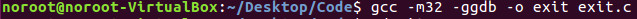
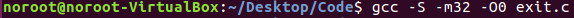
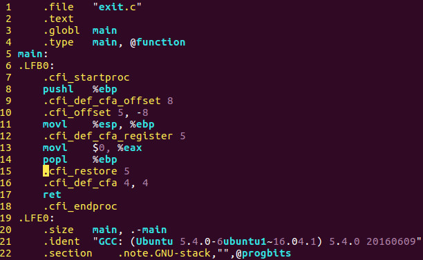
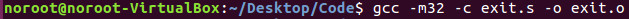
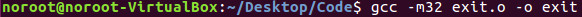
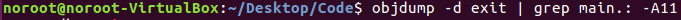
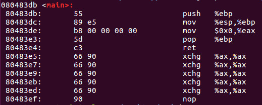
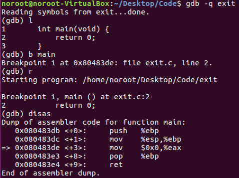
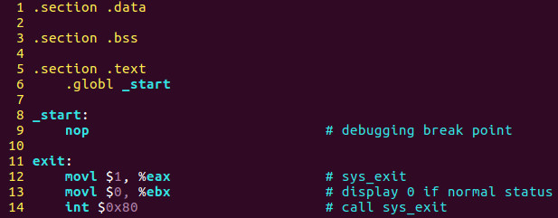
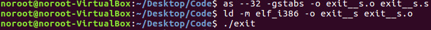

## Part 21 - How To Compile A Program

بیایید دوباره به برنامه C هفته گذشته نگاه کنیم و نگاهی عمیق‌تر به چگونگی تبدیل آن کد منبع به یک فایل اجرایی داشته باشیم.

برای کامپایل کردن این برنامه در C، به سادگی این دستور را تایپ می‌کنیم:

این مرحله به تنهایی دو فایل ایجاد می‌کند: __exit.o__ که فایل باینری شیء است و __exit__ که فایل باینری اجرایی است.

اگر بخواهیم این کد C را به اسمبلی تبدیل کنیم، باید از کامپایلر GNU به شکل زیر استفاده کنیم. ابتدا این دستور را در ترمینال اجرا می‌کنیم:

بیایید با سوئیچ ‌__-S__ شروع کنیم. سوئیچ ‌__-S__ کد منبع اسمبلی قابل مقایسه‌ای با نحو AT&T ایجاد می‌کند. سوئیچ ‌__-m32__ یک فایل اجرایی 32 بیتی تولید می‌کند و سوئیچ ‌__-O0__ به کامپایلر می‌گوید که چه مقدار بهینه‌سازی در هنگام کامپایل کردن باینری استفاده شود. اینجا حرف بزرگ ‌__O__ به همراه عدد ‌__0__ به معنای عدم بهینه‌سازی است، که یعنی مجموعه دستورالعمل‌ها به شکل قابل خواندن برای انسان خواهد بود. اگر شما از اعداد ‌__1__، ‌__2__ یا ‌__3__ استفاده کنید، میزان بهینه‌سازی با افزایش این اعداد بیشتر خواهد شد.

این مرحله بالا فایل __exit.s__ را ایجاد می‌کند که همان کد منبع زبان اسمبلی معادل است که قبلاً به آن اشاره کردیم.

سپس باید کد منبع اسمبلی را به یک فایل باینری تبدیل کنیم که یک فایل __exit.o__ ایجاد می‌کند.

در نهایت، باید از یک لینک‌کننده استفاده کنیم تا کد اجرایی باینری واقعی را از فایل باینری شیء ایجاد کنیم که یک فایل اجرایی به نام __exit__ تولید می‌کند.

هفته گذشته زمانی که فایل اجرایی __exit__ را در برنامه‌ای به نام __objdump__ بررسی کردیم و بخش __main__ را بررسی کردیم، به نتایج زیر رسیدیم. این بار از نحو (Syntax) زبان اسمبلی AT&T استفاده خواهیم کرد:

دستور بالا خروجی زیر را ایجاد خواهد کرد:

بیایید کد را در دیباگر بررسی کنیم. GDB که همان دیباگر GNU است را اجرا کنید و ابتدا با تایپ دستور `l` کد منبع را لیست کنید، سپس یک breakpoint در تابع main تنظیم کرده و برنامه را اجرا کنید. در نهایت برنامه را disassemble کنید و خروجی زیر را بررسی کنید:

در هر سه بررسی بالا، شما اساساً همان مجموعه دستورات را مشاهده خواهید کرد که در آموزش‌های آینده دقیق‌تر به آن‌ها خواهیم پرداخت و خواهیم دید که دقیقاً چه اتفاقی در حال رخ دادن است.

تا اینجا در این سری از آموزش‌ها، ما به بررسی زبان اسمبلی با سینتکس Intel پرداختیم. همان‌طور که گفته شد، اکنون تمرکز خود را به سینتکس AT&T معطوف می‌کنیم، زیرا این سینتکس به‌طور طبیعی در لینوکس با GNU Assembler و GNU Debugger استفاده می‌شود.

بزرگترین تفاوتی که خواهید دید این است که در سینتکس AT&T، منبع و مقصد برعکس می‌شوند.

سینتکس AT&T:  __movl %esp, %ebp__  \[این به معنای انتقال esp به ebp است.\]

سینتکس Intel:  __mov esp, ebp__  \[این به معنای انتقال ebp به esp است.\]

همچنین تفاوت‌های اضافی دیگری را خواهید دید که سینتکس AT&T از آن‌ها استفاده می‌کند و ما آن‌ها را در آموزش‌های بعدی پوشش خواهیم داد.

اگر بخواهیم برنامه‌ای با کد خالص اسمبلی ایجاد کنیم که همان کار بالا را انجام دهد، می‌توانیم به این شکل کد نویسی کنیم:

برای کامپایل این برنامه، از اسمبلر GAS و لینک‌کننده استفاده می‌کنیم:

برای اجرای هر برنامه اجرایی در لینوکس، باید `./` و نام فایل اجرایی باینری را تایپ کنید. در این مورد، ما `./exit` را تایپ کرده و کلید Enter را فشار می‌دهیم. وقتی این کار را انجام می‌دهیم، هیچ اتفاقی نمی‌افتد. این خوب است، زیرا تنها برنامه‌ای را ایجاد کردیم که به سیستم‌عامل خروجی می‌دهد.

منتظر دیدن شما در هفته آینده هستم که به بررسی کد اسمبلی بیشتری خواهیم پرداخت!