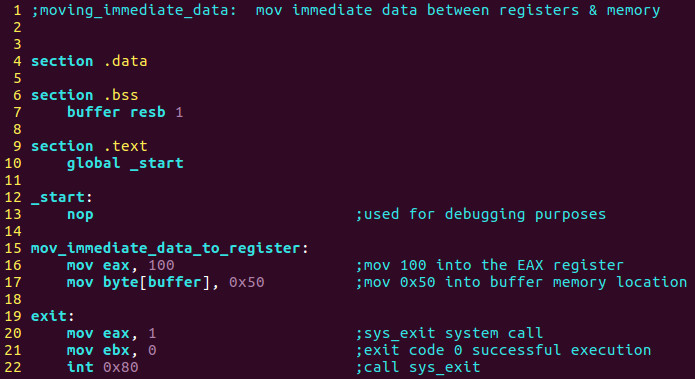

## Part 22 - ASM Program 1 \[Moving Immediate Data\]

از همه شما بابت صبر و شکیبایی‌تان سپاسگزارم، زیرا ۲۱ درس طول کشید تا به اولین برنامه ASM خود برسیم. اما لازم بود که پیش‌زمینه‌ای کامل پوشش داده شود تا درک کنیم که از کجا شروع کنیم.

ما قرار است برنامه‌های اسمبلی ۳۲ بیتی ایجاد کنیم، زیرا بیشتر بدافزارها در حالت ۳۲ بیتی نوشته شده‌اند تا بتوانند به حداکثر تعداد سیستم‌ها حمله کنند. به خاطر داشته باشید که با اینکه اکثر ما سیستم‌عامل‌های ۶۴ بیتی داریم، برنامه‌های ۳۲ بیتی می‌توانند بر روی آن‌ها اجرا شوند.

برای بخش عمده‌ای از کار خود با سینتکس اینتل در اسمبلی کار کرده‌ایم، اما به‌طور آینده بر سینتکس بومی AT&T تمرکز خواهیم کرد. تبدیل بین سینتکس اینتل و AT&T بسیار آسان است، همان‌طور که در درس‌های قبلی نشان داده‌ام.

هر برنامه اسمبلی به سه بخش تقسیم می‌شود:

1. **بخش داده (Data Section)**: این بخش برای اعلام داده‌های اولیه یا ثابت استفاده می‌شود، زیرا این داده‌ها در زمان اجرای برنامه تغییر نمی‌کنند. می‌توانید مقادیر ثابت، اندازه‌های بافر، نام فایل‌ها و غیره را اعلام کنید.

2. **بخش BSS**: این بخش برای اعلام داده‌ها یا متغیرهای بدون مقدار اولیه استفاده می‌شود.

3. **بخش متن (Text Section)**: این بخش برای کد واقعی برنامه است و با `global _start` شروع می‌شود که به کرنل می‌گوید اجرای برنامه از کجا آغاز می‌شود.

استفاده از نظرات در هر توسعه‌ای ضروری است. در سینتکس AT&T، ما از نماد `#` برای اعلام یک نظر استفاده می‌کنیم، زیرا هر داده‌ای که پس از آن نماد در یک خط باشد، توسط کامپایلر نادیده گرفته می‌شود.

به یاد داشته باشید که دستورات اسمبلی در یک خط وارد می‌شوند و نیازی به پایان خط با نقطه ویرگول مانند بسیاری از زبان‌های دیگر نیست. ساختار یک دستور به شکل زیر است:

```
[label] mnemonic [operands] [comment]
```

یک دستور پایه دارای دو بخش است که اولین بخش نام دستور یا نماد است که اجرا می‌شود و بخش دوم اوپران‌ها یا پارامترهای دستور است.

برنامه اول ما نشان می‌دهد که چگونه داده‌های فوری را به یک رجیستر و سپس به حافظه منتقل کنیم.

بیایید VIM را باز کنیم و برنامه‌ای به نام `moving_immediate_data.s` ایجاد کنیم و کد زیر را تایپ کنیم:


برای کامپایل، شما تایپ می‌کنید:

```
as –32 -o moving_immediate_data.o moving_immediate_data.s
ld -m elf_i386 -o moving_immediate_data moving_immediate_data.o
```

برای اجرا شما تایپ می‌کنید:

```
./moving_immediate_data
```

می‌خواهم به شما نشان دهم که در سینتکس اینتل چگونه به نظر می‌رسد. قبل از اینکه به این بخش بپردازیم، باید در یک خط فرمان تایپ کنید:

```
sudo apt-get install nasm
```

این دستور، Netwide Assembler را نصب خواهد کرد.



برای کامپایل، شما تایپ می‌کنید:

```
nasm -f elf32 moving_immediate_data.asm
ld -m elf_i386 -o moving_immediate_data moving_immediate_data.o
```

برای اجرا شما تایپ می‌کنید:

```
./moving_immediate_data
```

اوکی، چه خبر! هیچ خروجی‌ای وجود ندارد! درست است و شما اشتباهی نکردید. بسیاری از برنامه‌های ما واقعاً کاری انجام نمی‌دهند زیرا بیشتر از اینکه برنامه‌های عملیاتی باشند، برنامه‌های آزمایشی هستند که ما از آن‌ها در GDB برای تحلیل و دستکاری استفاده خواهیم کرد.

هفته آینده به دیباگر GNU GDB می‌پردازیم و می‌بینیم که چه خبر است.

می‌خواهم زمانی را به بررسی کد در خطوط ۲۰ تا ۲۲ در نسخه AT&T و همچنین نسخه سینتکس اینتل اختصاص دهم. این مجموعه دستورالعمل‌ها از آنچه که ما آن را یک وقفه نرم‌افزاری می‌نامیم، استفاده می‌کند. در خط ۲۰ در سینتکس AT&T، ما __movl $1, %eax__ داریم که به این معنی است که مقدار ده‌دهی ۱ را به eax منتقل می‌کنیم که مشخص می‌کند که sys_exit فراخوانی می‌شود تا اجرای برنامه به درستی به لینوکس بازگردد تا از خطای تقسیم‌بندی جلوگیری شود. در خط ۲۱، ما __movl $0, %ebx__ داریم که ۰ را به ebx منتقل می‌کند تا نشان دهد که برنامه با موفقیت اجرا شده است و در نهایت ما __int $0x80__ را مشاهده می‌کنیم.

خطوط ۲۰ و ۲۱ وقفه نرم‌افزاری را تنظیم می‌کنند که در خط ۲۲ با دستور __int $0x80__ فراخوانی می‌شود. بیایید کمی عمیق‌تر به این موضوع بپردازیم.

در لینوکس، دو ناحیه مجزای حافظه وجود دارد. در پایین‌ترین قسمت حافظه در هر اجرای برنامه، ما فضای هسته (Kernel Space) داریم که شامل بخش Dispatcher و جدول وکتور (Vector Table) است.

در بالاترین قسمت حافظه در هر اجرای برنامه، ما فضای کاربر (User Space) داریم که شامل پشته (Stack)، انباشته (Heap) و در نهایت کد شما است که تمام این‌ها می‌توانند در نمودار زیر نشان داده شوند:


وقتی که مقادیر را همان‌طور که در بالا نشان دادیم بارگذاری می‌کنیم و INT 0x80 را فراخوانی می‌کنیم، آدرس دستور بعدی در فضای کاربر، بخش کد ASM شما، در ناحیه آدرس بازگشت در پشته قرار می‌گیرد. این موضوع حیاتی است تا وقتی که INT 0x80 کار خود را انجام می‌دهد، به درستی بداند که چه دستوری باید بعد از آن اجرا شود تا اطمینان حاصل شود که اجرای برنامه به درستی و به صورت متوالی ادامه یابد.

به خاطر داشته باشید که در نسخه‌های مدرن لینوکس، ما از حالت محافظت‌شده (Protected Mode) استفاده می‌کنیم که به این معنی است که شما به فضای هسته لینوکس دسترسی ندارید. هر چیزی که زیر خط بلندی که در وسط نمودار بالا اجرا می‌شود، نمایانگر فضای هسته لینوکس است.

سوالی که به طور طبیعی پیش می‌آید این است که چرا نمی‌توانیم به این فضا دسترسی پیدا کنیم؟ پاسخ بسیار ساده است: لینوکس به شما اجازه نمی‌دهد که کد شما به اجزای داخلی سیستم‌عامل دسترسی پیدا کند زیرا این امر بسیار خطرناک خواهد بود و هر نوع بدافزاری می‌تواند آن اجزا را دستکاری کند تا تمام انواع اطلاعات مانند فشار کلیدهای کاربر، فعالیت‌ها و غیره را پیگیری کند.

علاوه بر این، معماری مدرن سیستم‌عامل لینوکس آدرس این اجزای کلیدی را به طور مداوم تغییر می‌دهد زیرا نرم‌افزارهای جدید نصب و حذف می‌شوند و همچنین به‌روزرسانی‌ها و اصلاحات سیستم انجام می‌شود. این اصل پایه‌ای سیستم‌عامل‌های حالت محافظت‌شده است.

شیوه‌ای که کد ما با هسته لینوکس ارتباط برقرار می‌کند، از طریق استفاده از دروازه فراخوانی خدمات هسته است که یک دروازه محافظت‌شده بین فضای کاربر که برنامه شما در آن اجرا می‌شود و فضای هسته که از طریق وقفه نرم‌افزاری لینوکس 0x80 پیاده‌سازی شده است، عمل می‌کند.

در پایین‌ترین قسمت حافظه، جایی که بخش 0 و آفست 0 وجود دارد، یک جدول جستجو با ۲۵۶ ورودی وجود دارد. هر ورودی یک آدرس حافظه است که شامل بخش و آفست است که هر ورودی ۴ بایت است و ۱۰۲۴ بایت اول به این جدول اختصاص داده شده و هیچ کد دیگری نمی‌تواند آنجا دستکاری شود. هر آدرس یک وکتور وقفه نامیده می‌شود که به طور کلی جدول وکتور وقفه نامیده می‌شود و هر وکتور شماره‌ای از ۰ تا ۲۵۵ دارد که وکتور ۰ ابتدا بایت‌های ۰ تا ۳ را اشغال می‌کند. این روند با وکتور ۱ ادامه می‌یابد که شامل ۴ تا ۷ و غیره است.

به خاطر داشته باشید که هیچ‌کدام از این آدرس‌ها بخشی از حافظه دائمی نیستند. آنچه که ثابت است وکتور 0x80 است که به مبدل خدمات اشاره می‌کند که به روال‌های خدمات هسته لینوکس اشاره دارد.

وقتی که آدرس بازگشت از پشته خارج می‌شود و به دستور بعدی بازمی‌گردد، این دستور به نام بازگشت وقفه (Interrupt Return) یا IRET نامیده می‌شود که اجرای جریان برنامه را کامل می‌کند.

کمی وقت بگذارید و تمام جدول سیستم‌کال‌ها را با باز کردن یک ترمینال و تایپ کردن:

```
cat /usr/include/asm/unistd_32.h
```

نگاه کنید. در زیر یک عکس فوری از چند مورد از آن‌ها آورده شده است. همان‌طور که می‌بینید، exit 1 نمایانگر sys_exit است که ما در کد بالا استفاده کردیم.


از این درس به بعد، ما یک رویکرد سه‌مرحله‌ای خواهیم داشت:

1. **برنامه**  
2. **دیباگ**  
3. **هک**  

هر هفته با یک برنامه شروع می‌کنیم، مانند آنچه که در اینجا می‌بینید، هفته آینده آن را به GDB می‌بریم و دقیقاً بررسی می‌کنیم که چه اتفاقی در سطح اسمبلی می‌افتد و در نهایت در سومین قسمت هر هفته داده‌ها را در GDB هک می‌کنیم تا آن را به هر چیزی که می‌خواهیم تغییر دهیم و توانایی کنترل جریان برنامه را نشان دهیم که شامل یادگیری نحوه هک بدافزار به نقطه‌ای است که دیگر تهدیدی نباشد.

ما الزاما به طور مستقیم به بدافزار نخواهیم پرداخت، زیرا ترجیح می‌دهم بر روی موضوعات برنامه‌های زبان اسمبلی تمرکز کنم که به شما ابزارها و درک لازم را می‌دهد تا هر برنامه‌ای را بتوانید دیباگ و دستکاری کنید. هدف این آموزش‌ها همین است.

اطلاعاتی که در این مجموعه آموزش‌ها خواهید آموخت، می‌تواند با دیباگرهای GUI با سطح بالا مانند IDA Pro نیز استفاده شود، اما من فقط بر روی دیباگر GNU GDB تمرکز خواهم کرد.

منتظر دیدن شما در هفته آینده هستم تا اولین دیباگ اسمبلی خود را بسازیم!