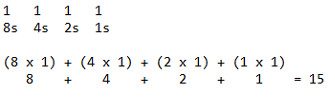

## Part 5: Binary Number System

اعداد باینری هسته‌ی اصلی یک کامپیوتر را تعریف می‌کنند. یک بیت در یک کامپیوتر یا روشن است یا خاموش. یک بیت یا برق به آن وصل است یا چنین برقی وجود ندارد. ما در آموزش‌های آینده بیشتر در این مورد صحبت خواهیم کرد.

احتمالاً دچار سردرگمی و گیجی شده‌اید. حالا باید چه کار کنیم؟

نگران نباشید! سیستم عددی باینری اینجاست! درک این نکته مهم است که در باینری، هر ستون دارای ارزشی برابر با دو برابر ستون سمت راست خود است و فقط دو رقم در این پایه وجود دارد که آن‌ها ۰ و ۱ هستند.

در سیستم دسیمل (پایه ۱۰)، فرض کنید عدد ۱۵ داریم که به معنای (۱ × ۱۰) + (۵ × ۱) = ۱۵ است. بنابراین، ۵ عددی است که در ۱ ضرب می‌شود و ۱ عددی است که در ۱۰ ضرب می‌شود.

سیستم باینری به همین شکل کار می‌کند، با این تفاوت که در اینجا به پایه ۲ اشاره داریم. همان عدد در باینری برابر با ۱۱۱۱ است. برای توضیح بیشتر:

اعداد باینری مهم هستند زیرا استفاده از آن‌ها به جای سیستم دسیمل طراحی کامپیوترها و فناوری‌های مرتبط را ساده‌تر می‌کند. ساده‌ترین تعریف سیستم عددی باینری، سیستمی است که فقط از دو رقم استفاده می‌کند، همان‌طور که بالاتر ذکر کردیم، تا اعداد مورد نیاز برای معماری کامپیوتر را نمایان کند، به جای استفاده از ارقام ۰ تا ۹.

در درس بعدی به سیستم عددی هگزادسیمال خواهیم پرداخت. از اینجا به بعد، ماجرا هیجان‌انگیزتر می‌شود!