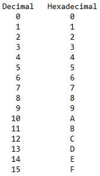
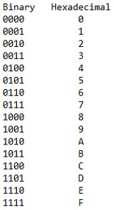
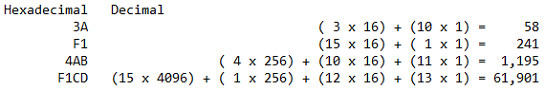
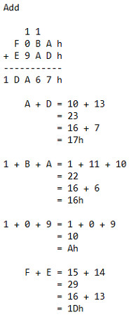
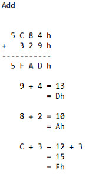
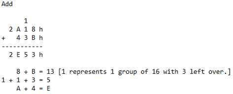
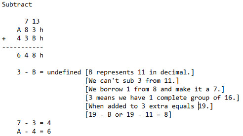

حالا که ما در باینری استاد شده‌ایم، زمان آن است که به سیستم عددی سیستم‌های عددی بپردازیم!

در باینری آموختیم که هر عدد نمایانگر یک بیت است. اگر ۸ بیت را ترکیب کنیم، به یک بایت می‌رسیم. یک بایت می‌تواند به دو قسمت بالایی ۴ بیت و پایینی ۴ بیت تقسیم شود. ترکیب ۴ بیت یک نابل (nibble) نامیده می‌شود. از آنجا که ۴ بیت محدوده‌ای از ۰ تا ۱۵ را فراهم می‌کند، کار با سیستم عددی پایه ۱۶ ساده‌تر است. به یاد داشته باش که وقتی می‌گوییم پایه ۱۶، از ۰ شروع می‌کنیم و بنابراین ۰ تا ۱۵ شامل ۱۶ عدد متفاوت می‌شود.

این سیستم عددی هیجان‌انگیز، هگزادسیمال نامیده می‌شود. دلیل استفاده از این سیستم عددی این است که در اسمبلی x86، بیان نمایه‌های عددی باینری در هگزادسیمال بسیار ساده‌تر از هر سیستم عددی دیگری است.

هگزادسیمال مشابه سایر سیستم‌های عددی است، با این تفاوت که در هگزادسیمال، هر ستون ارزش ۱۶ برابر ارزش ستون سمت راست خود را دارد. بخش جالب در مورد هگزادسیمال این است که نه تنها از اعداد ۰، ۱، ۲، ۳، ۴، ۵، ۶، ۷، ۸، ۹ استفاده می‌کنیم، بلکه A، B، C، D، E و F را نیز داریم و به این ترتیب ۱۶ نماد متفاوت داریم.

بیایید نگاهی به یک جدول ساده بیندازیم تا ببینیم هگزادسیمال چگونه با دسیمل مقایسه می‌شود.

&nbsp;&nbsp;&nbsp;&nbsp;&nbsp;&nbsp;

باشه، می‌بینم که همه چیز برایت کمی گیج‌کننده شده است، اما اشکالی ندارد! در سیستم دسیمل، همه چیز با توان ۱۰ مدیریت می‌شود. بیایید عدد ۴۲ را در دسیمل بررسی کنیم:

2 x 10 ^ 0 = 2

4 x 10 ^ 1 = 40

Remember 10 to the 0 power is 1 and 10 to the 1st power is 10, therefore, 2 + 40 = 42.

اگر درک کنیم که دسیمل یک سیستم عددی پایه ۱۰ است، می‌توانیم یک فرمول ساده بسازیم که در آن bbb نمایانگر پایه است. در این مورد، b=10b = 10b=10.

(2 \* b ^ 0) + (4 \* b ^ 1)

(2 \* 10 ^ 0) + (4 \* 10 ^ 1) = 42

In binary, 42 decimal is 0010 1010 binary as follows:

0 x 2 ^ 0 = 0

1 x 2 ^ 1 = 2

0 x 2 ^ 2 = 0

1 x 2 ^ 3 = 8

0 x 2 ^ 4 = 0

1 x 2 ^ 5 = 32

0 x 2 ^ 6 = 0

0 x 2 ^ 7 = 0

0 + 2 + 0 + 8 + 0 + 32 + 0 + 0 = 42 decimal

In hexadecimal, everything is dealt with in the power of 16. Therefore 42 in decimal is 2A in hexadecimal:

10 \* 16 ^ 0 = 10

2 \* 16 ^ 1 = 32

10 + 32 = 42 decimal =&gt; 2A hexadecimal

This is the same as saying:

10 \* 1 = 10

2 \* 16 = 32

10 + 32 = 42 decimal =&gt; 2A hexadecimal

Keep in mind 10 decimal is equal to A hexadecimal and 2 decimal is equal to 2 hexadecimal. In our formula above when we deal with A, B, C, D, E or F we need to convert them to their decimal equivalent.

Lets take another example of F5 hexadecimal. This would be as follows:

5 x 16 ^ 0 = 5

15 x 16 ^ 1 = 240

5 + 240 = 245 decimal =&gt; F5 hexadecimal

Lets look at a binary to hexadecimal table:

  

  

&nbsp;&nbsp;&nbsp;

It is important to understand that every hexadecimal number is 4 bits long or called a nibble. This will become critical when we are reverse engineering our C programs into Assembly.

Lets look at this another way. Lets work with some more hexadecimal numbers and convert them to decimal:

To re-emphasize F1CD as a simple conversion:

D --- 13 x 1 = 13

C --- 12 x 16 = 192

1 --- 1 x 256 = 256

F --- 15 x 4096 = 61,440

13 + 192 + 256 + 61,440 = 61,901

Addition in hexadecimal works as follows. From this point forward all numbers in hexadecimal will have a 'h' next to the number:

&nbsp;&nbsp;&nbsp;&nbsp;&nbsp;&nbsp;&nbsp;&nbsp;

Another example is as such:

&nbsp;&nbsp;&nbsp;&nbsp;&nbsp;&nbsp;

A final add example is as such:

We will now focus on subtraction:

شاید از خودتان بپرسید چرا این شخص اینقدر زمان صرف بررسی روش‌های مختلف یادگیری می‌کند! جواب این است که هر کدام از ما به شکلی متفاوت یاد می‌گیریم. من می‌خواستم چندین نمایش مختلف از هگزادسیمال را نسبت به دسیمل و باینری نشان دهم تا به شما کمک کنم کل ماجرا را بهتر درک کنید.

درک این موضوع برای پیشرفت به مراحل بعدی بسیار اساسی است. اگر سوالی دارید، لطفاً در زیر کامنت بگذارید و من با کمال میل به شما کمک خواهم کرد!

در درس بعدی به سوئیچ‌ها، ترانزیستورها و حافظه خواهیم پرداخت.