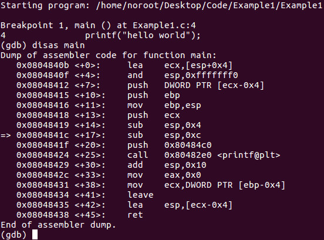
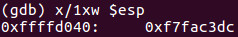

## Bytes

اینو میدونیم که هر ۸ بیت ، یک Byte هست . حافظه هم با بایت اندازه‌گیری میشه یعنی بیت به تنهایی نمیتونه توی حافظه ثبت شه و باید در غالب بایت ذخیره شه . 

?> وقتی تو این دروس از کلمه حافظه استفاده میکنیم ، منظور همون RAM کامپویتر هست . بنابراین وقتی که میگیم RAM کامپیوتر من 16GB هست یعنی شما میتونی 16 میلیارد بایت توی حافظت ذخیره و مقداردهی کنی .  
**نکته** : پیشوند **گیگا (Giga)** در سیستم بین‌المللی واحدها به معنی **میلیارد** (یا ۱۰^۹) هست. این پیشوند با حرف **G** نمایش داده می‌شه و وقتی به واحدی اضافه می‌شه، مقدار اون رو یک میلیارد برابر بزرگ‌تر می‌کنه.

حالا تمام این 16 میلیارد بایت که توی حافظه هستند و قابل مقداردهی هستند ، یک آدرس منحصر بفرد دارند . اینو فعلا ازم داشته باشید .

## Word

حالا به هر دو بایت یک کلمه Word گفته میشه ، به هر ۴ بایت Double Word گفته میشه ، به هر 8 بایت هم Quad Word گفته میشه .
دو بایت به نام یک کلمه (word) شناخته می‌شوند و دو کلمه به نام یک دابل وورد (double word) که شامل چهار بایت (۳۲ بیت) است. همچنین یک کواد وورد (quad word) شامل هشت بایت (۶۴ بیت) است.

یک بایت ۸ بیت است و معادل \(2^8\) است که برابر با ۲۵۶ می‌شود. تعداد اعداد باینری با اندازه ۸ بیت یکی از ۲۵۶ مقدار است که از ۰ شروع می‌شود و تا ۲۵۵ ادامه می‌یابد.

هر بایت از حافظه در یک کامپیوتر دارای آدرس منحصربه‌فرد خود است. بیایید دستورات دیساسمبل‌شده برای یک برنامه ساده "سلام دنیا" در لینوکس را بررسی کنیم با قرار دادن یک نقطه توقف (breakpoint) روی تابع اصلی. ما از دیباگر GDB استفاده خواهیم کرد:

نگران نباشید اگر این هنوز برای شما واضح نیست. هدف از استفاده از این مثال این است که شما یک پیش‌نمایش از اولین برنامه‌ای که بررسی خواهیم کرد را ببینید و همچنین درباره حافظه در یک کامپیوتر بیشتر یاد بگیرید.

در زیر یک بررسی از رجیستر ESP آمده است. دوباره، ضروری نیست که بفهمید یک رجیستر چیست یا ESP چه کاری انجام می‌دهد. ما فقط می‌خواهیم ببینیم که یک مکان حافظه چگونه به نظر می‌رسد:

&nbsp;

ما آدرس حافظه 0xffffd040 را می‌بینیم که البته در قالب هگزادسیمال است. همچنین مقدار موجود در رجیستر ESP را می‌بینیم که 0xf7fac3dc است و آن هم در قالب هگزادسیمال می‌باشد.

مهم است که درک کنیم 0xffffd040 شامل ۴ بایت است و یک دابل وورد محسوب می‌شود. همان‌طور که در بخش ۶: سیستم عدد هگزادسیمال یاد گرفتیم، هر رقم هگزادسیمال ۴ بیت طول دارد که به آن nibble هم می‌گویند. در 0xffffd040، بیایید به آخرین رقم ۰ نگاه کنیم. در این مثال، ۰ (هگزادسیمال) ۴ بیت طول دارد. اگر به ۴۰ (در هگزادسیمال) نگاه کنیم، می‌بینیم که این یک بایت یا ۸ بیت طول دارد. اگر به d040 توجه کنیم، دو بایت یا یک کلمه طول دارد. در نهایت، ffffd040 یک دابل وورد یا ۴ بایت طول دارد که معادل ۳۲ بیت است. پیشوند 0x در ابتدای آدرس تنها نشان‌دهنده این است که این یک مقدار هگزادسیمال است.

یک برنامه کامپیوتری چیزی جز دستورات ماشین ذخیره شده در حافظه نیست. یک CPU ۳۲ بیتی یک دابل وورد را از یک آدرس حافظه دریافت می‌کند. یک دابل وورد ۴ بایت متوالی است که از حافظه خوانده شده و به CPU بارگذاری می‌شود. به محض اینکه CPU دستور را اجرا کرد، آدرس بعدی دستور ماشین را از نشان‌گر دستور (instruction pointer) می‌گیرد.

برای شما که تازه با اسمبلی آشنا شده‌اید، این اولین نگاهی است که دارید. اگر از دیدن این موارد دلسرد یا ناامید شده‌اید، نگران نباشید. ما به آرامی جلو می‌رویم و از مثال‌های متعدد استفاده می‌کنیم تا هر مرحله را در درس‌های آینده بررسی کنیم. مهم است که شما زمان خود را بگذارید و بررسی کنید که هر درس درباره چه موضوعی بحث می‌کند. لطفاً همیشه احساس راحتی کنید و با هر سوالی در پایین کامنت بگذارید.

در آموزش بعدی، ما به مبانی معماری x86 خواهیم پرداخت.