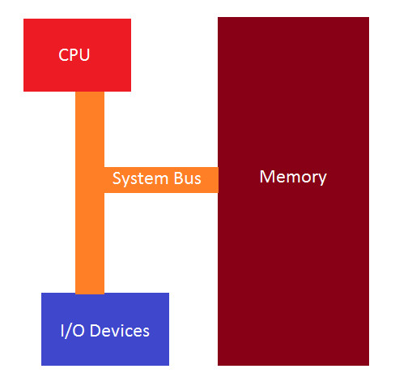
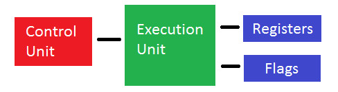

## Part 9: x86 Basic Architecture

یک برنامه کامپیوتری به سادگی یک جدول از دستورات ماشین است که در حافظه ذخیره شده و شماره‌های باینری که برنامه را تشکیل می‌دهند، فقط به شیوه‌ای که CPU با آن‌ها برخورد می‌کند، منحصر به فرد هستند.

معماری پایه شامل یک CPU، حافظه و دستگاه‌های ورودی/خروجی (I/O devices) است که همه این‌ها از طریق یک سیستم باس به هم متصل شده‌اند.

CPU از ۴ بخش تشکیل شده است:

1) **واحد کنترل (Control Unit)** - دستورات را از CPU بازیابی و رمزگشایی می‌کند و سپس آن‌ها را در حافظه ذخیره و بازیابی می‌کند.

2) **واحد اجرایی (Execution Unit)** - جایی است که اجرای دستورات و بازیابی آن‌ها انجام می‌شود.

3) **ثبت‌ها (Registers)** - مکان‌های حافظه داخلی CPU هستند که برای ذخیره‌سازی موقتی داده‌ها استفاده می‌شوند.

4) **پرچم‌ها (Flags)** - رویدادهایی را که هنگام اجرای دستورات اتفاق می‌افتد، نشان می‌دهند.

ما در اینجا درباره‌ی x86 ۳۲ بیتی صحبت خواهیم کرد. بنابراین، یک CPU ۳۲ بیتی ابتدا یک double word (۴ بایت یا ۳۲ بیت) را از یک آدرس خاص در حافظه بازیابی کرده و آن را به CPU بارگذاری می‌کند. در این مرحله، CPU الگوی باینری بیت‌ها را درون double word بررسی کرده و شروع به اجرای فرایندی می‌کند که دستور ماشین بازیابی شده به آن اشاره دارد.

پس از اتمام اجرای یک دستور، CPU به حافظه رفته و دستور ماشین بعدی را در دنباله بازیابی می‌کند. CPU دارای یک ثبت (Register) است که در آموزش‌های آینده درباره‌ی آن صحبت خواهیم کرد، به نام EIP یا نشانگر دستور، که آدرس دستور بعدی را که باید از حافظه بازیابی و سپس اجرا شود، در خود نگه می‌دارد.

به‌وضوح می‌توان دید که اگر ما جریان EIP را کنترل کنیم، می‌توانیم برنامه را طوری تغییر دهیم که کارهایی را انجام دهد که برای آن طراحی نشده است. این یک تکنیک رایج است که بدافزارها بر آن تکیه دارند.

کل فرایند بازیابی و اجرا به ساعت سیستم متصل است که یک نوسان‌ساز است و پالس‌های موج مربعی را در فواصل مشخص تولید می‌کند.

در آموزش بعدی به طور عمیق‌تر به معماری IA-32 خواهیم پرداخت و درباره‌ی ثبت‌های عمومی (General-purpose Registers) صحبت خواهیم کرد.